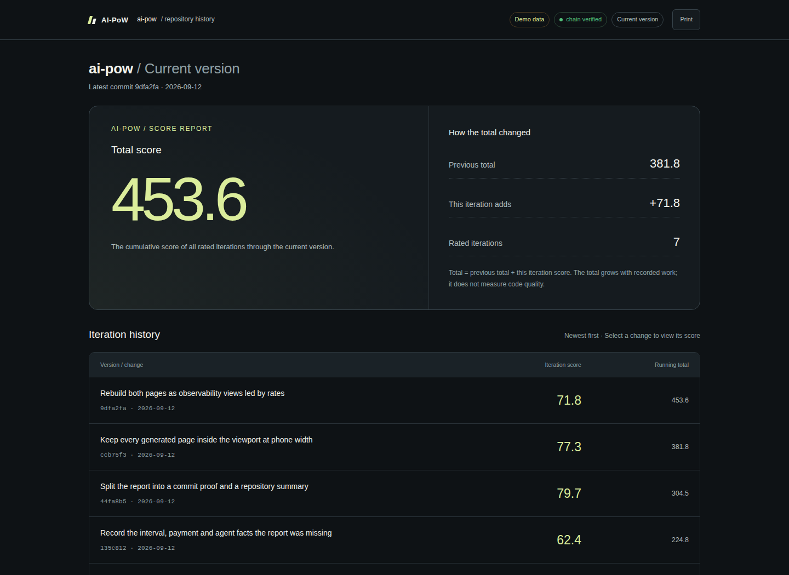

# AI-PoW

### Work, made visible.

A versioned process score and a verifiable work journal for every Git commit.

[](https://github.com/lin7c/ai-pow/actions/workflows/tests.yml)
[](https://www.python.org/)
[](LICENSE)

**[Repository summary](https://lin7c.github.io/ai-pow/demo/)** · **[Commit proof](https://lin7c.github.io/ai-pow/demo/reports/135c812f3ad6cfa5e5e164296f053771331f176f.html)** · [Scoring specification](docs/METRICS.md) · [Protocol](docs/PROTOCOL-v0.1.md)

[](https://lin7c.github.io/ai-pow/demo/)

*The preview uses clearly labeled synthetic history evaluated by the production scoring algorithm.*

## The idea

A Git diff shows what changed. AI-PoW records more of the work behind it: human input, visible AI responses, model usage, agent architecture, and sampled artifact revisions. It binds those observations to the resulting commit as a **proof vector**, derives a transparent process score from the part that can be checked against the commit, and writes an offline HTML report.

**v0.8 includes:**

- **A real iteration chain.** Every commit appends one hash-linked row: `cumulative(T-1) + contribution(T)`. The history is accumulated, not replayed from whatever proofs happen to still exist, so pruning an old proof cannot shrink it. `aipow index --rebuild` recomputes the chain from sealed proofs.
- **Each rate compared with the project's own baseline** — every commit recorded before this one — plus a sparkline of the last twelve recorded commits, so a number on the run view can be read without opening a second page.
- **Two observability pages.** `reports/<commit>.html` is a run view for one commit; `index.html` is a dashboard over the chain.
- **Expandable efficiency metrics**: human tokens per surviving edit, reading burden per message, AWC per surviving edit, retention, throughput, tool calls per edit, cache-read share, failed-tool share.
- A session timeline drawn from real timestamps, per-file work with real paths, per-model and per-tool share tables, the agent spawn tree, and event volume by type.
- Gaps in the chain (amend, rebase, boundary reset, unrecorded commits) are marked, not hidden.
- **Scores lead both pages.** The current-version dashboard highlights the cumulative total; each iteration highlights its own 0–100 score. Supporting data is grouped into three collapsed sections.
- A bounded local recorder, hash-chained export, and verification against actual Git objects.
- A Claude Code adapter, generic agent wrapper, and shared core for the laintas-cli development integration.

Python 3.10+ and Git. **No third-party runtime dependencies, hosted account, permanent daemon, background model calls, or telemetry.**

## Start recording

```bash
python3 -m venv .venv
. .venv/bin/activate
python -m pip install "git+https://github.com/lin7c/ai-pow.git"

cd /path/to/your/git-project
aipow init
aipow claude
```

Work normally and commit:

```bash
git add src/app.py
git commit -m "Implement the feature"
```

The post-commit hook seals the proof and writes two pages under `.git/ai-pow/`: the commit proof at `reports/<commit>.html` and the repository summary at `index.html`. It prints the proof path. Both work offline and need no preview server.

Existing or shared hooks are never replaced. If automatic hook installation is unavailable, integrate the printed command yourself or run `aipow seal` after each commit. For explicitly manual operation, initialize with `aipow init --no-hook`.

## The two pages

```bash
# This commit: identity, human, machine, agent, artifact, timeline, result, provenance.
aipow report --html

# The repository: the iteration chain, trends, development style, every recorded commit.
aipow index --html

# Recompute the chain from sealed proofs (after an upgrade or a restored database).
aipow index --rebuild --html

# Export a shareable standalone page; existing files are not overwritten.
aipow report --html --output /path/outside/project/commit-proof.html
aipow index --html --output /path/outside/project/history.html

# Machine-readable proof and independent verification.
aipow report
aipow index
aipow verify
aipow export /path/outside/project/commit-proof.jsonl
```

The commit proof embeds only its own interval; the repository summary embeds one compact row per commit and links to each proof. Both include keyboard focus states, mobile layouts and Print / PDF.

History follows the current commit's first-parent ancestry, not all branches. Averages exclude the current commit and incompatible scoring algorithms. Same-scope comparisons match the approximate scope cohort; the local percentile requires at least three prior peers. “Same grade” means the same score band, not a global skill ranking.

Reports are generated after committing and remain outside the tracked source tree. They are **not automatically uploaded to GitHub**. Share an explicit export only after reviewing its contents.

### Two pages, two different questions

`.git/ai-pow/reports/<commit>.html` answers "what happened between the last commit and this one". `.git/ai-pow/index.html` answers "how has this project used AI over its lifetime". The run view is the core record; the dashboard summarises many of them.

Both open with comparable **rates**, because raw totals only tell you how big the change was:

| Rate | What differs between people |
| --- | --- |
| human tokens / surviving edit | how much steering the work needed |
| visible tokens / message | how much reading the agent demanded |
| AWC / surviving edit | what the machine cost per unit of kept work |
| surviving / observed edits | how much was thrown away before the commit |
| surviving edits / hour | how fast kept work accumulated |
| tool calls / surviving edit | how much machinery each kept edit took |
| cache reads / input tokens | how well the setup reuses context |
| failed / total tool calls | how much of the automation misfired |

**Run view: iteration score first.** The 0–100 score leads alongside its evidence confidence and status. Efficiency, execution details, and verification remain available in expandable sections. The score describes recorded work, not code quality.

**Iteration history: cumulative score, starting at 0.** Add each commit's existing score exactly once. Alongside it, **repository totals** pool the raw quantities (human tokens, machine work, agent activity, artifact operations) and recompute their ratios from those pooled totals.

```text
Commit scores: 81.4 + 43.6 + 50.0
Project total: 175.0
```

No separate code-line scoring, additional weighting, deductions, tiers, or upper limit. A commit worth 81.4 adds exactly 81.4, regardless of its confidence or the existing total. The single-commit scoring system is unchanged.

The total uses the complete locally available first-parent score history, even when only 30 rows are visible. Unscored commits add nothing; their scores are not invented. Refreshing or regenerating a report never adds a commit twice. Historical scores are used as originally recorded, including older score algorithms. The cumulative policy is `commit-sum-v1`; it is a total, not a quality ranking. The latest-only export contains neither historical rows nor a cumulative score.

Upgrading does not change sealed commit scores. Run `aipow report --html` to regenerate a commit proof and `aipow index --html` to regenerate the repository summary.

## What makes the score higher?

| Dimension | Weight | Higher score |
| --- | ---: | --- |
| Input retention | 40% | More observed edits linked to human messages remain |
| Artifact survival | 40% | Less observed rewriting is discarded before the commit |
| Task fulfillment | 20% | More declared attempts finish with committed artifact evidence |

Installing more Skills or spawning more agents does not earn points.

**Resource use is recorded, never scored.** Cost, tokens, tool calls and output length appear in the proof vector and carry no weight. Calling any of them "efficient" requires a comparable result, which this recorder cannot observe — and a resource term would reward doing less AI work, which is the opposite of a proof of work. Result and PoW stay on separate axes.

**A dimension with no evidence cedes its weight** to the dimensions that do have evidence, instead of pulling every sparse commit toward 50. The report names which dimensions the score used.

Small samples are smoothed toward **50**, and missing evidence stays neutral rather than receiving 100%. A smooth logistic curve avoids easy extremes. Evidence confidence below 65% is marked **provisional**.

| Grade | Score |
| --- | --- |
| S | 90+ |
| A | 80–89.9 |
| B | 65–79.9 |
| C | 50–64.9 |
| D | 35–49.9 |
| E | Below 35 |

The included calibration examples range from **40.6** at 40% retention to **85.6** at 98% retention. A small commit with high retention lands below a large one with slightly lower retention, because less evidence keeps the result nearer 50. These are examples, not a claim about the distribution of real developers.

**This is a process score, not a code-quality score.** A necessary experiment can reduce survival. Removing bad code can improve the software. Temporal prompt attribution is not semantic understanding, file units are only structural/content proxies, and declared task completion is not a passed acceptance test. Never retain bad code to improve a number.

Read the [complete formulas, normalization anchors, missing-data policy, and limitations](docs/METRICS.md). Raw measurements remain separate; the score is stored at `proof.score.value`.

### Record task outcomes explicitly

```bash
aipow task checkout --status active
# Work on the task...
aipow task checkout --status completed --evidence src/checkout.py tests/test_checkout.py
```

Use stable IDs. Reopening a completed or dropped task starts another attempt. Evidence paths must be repository-relative and exist with inspectable content in the final commit. Tasks are not silently inferred by a paid scoring model.

## Use your preferred agent

```bash
aipow claude
aipow run -- your-agent
aipow run -- bash
aipow sample
```

| Integration | Capture | Limits |
| --- | --- | --- |
| Claude Code | Prompt/display hooks, tool and sub-agent events, incremental model-usage metadata | Hook/transcript fields vary by version; late events can cross boundaries |
| laintas-cli development integration | Native input/display, usage, tools, Skill injection, child creation | Requires a build bundling this integration; auxiliary workflows may leave gaps |
| Generic wrapper | Run boundaries and sampled files | Detailed prompt, token, and tool accounting needs an adapter |
| Manual editing | File samples through a wrapped shell or sample command | Rapid/unobserved writes cannot be recovered |

For a compatible laintas-cli build:

```bash
laintas-cli pow init
laintas-cli
laintas-cli pow report --html
laintas-cli pow verify
```

Both frontends share the per-worktree store. AI-PoW is independent of laintas-cli. Claude settings are invocation-scoped; the adapter does not change global settings or tool permissions. There is no dedicated Codex/OpenCode transcript parser in this release.

## What verification proves

```bash
aipow verify --bundle /path/to/commit-proof.jsonl
```

Verification checks the proof hash, event chain and sequence, recomputed measurements and prices, Git commit/tree/parents, and the score rebuilt from trace evidence and committed blobs.

It proves **local consistency**, not truthful execution, complete capture, accurate timestamps, or correct software. An operator can fabricate an entire local chain. Unqualified payment systems and developer leaderboards should not rely on it.

The protocol retains version 0.1 and supports legacy unscored proofs. Scoring is separately versioned as `retention-v2`, and the accounting reducer as `observed-v4`. Verification recomputes a proof under the algorithms **it** recorded, so proofs sealed with `balanced-v1` / `observed-v2` keep verifying unchanged and an unknown algorithm fails instead of being reinterpreted.

## Storage, privacy, and overhead

```text
<worktree-git-directory>/ai-pow/
  events.sqlite3
  reports/
    <commit>.html
  recording-error       # present after an observed recorder failure
```

| Resource | Bound / behavior |
| --- | --- |
| Event database | 64 MiB default per worktree; no automatic evidence deletion |
| Event payload | Approximately 16 KiB |
| File scan | 2,000 candidates; 256 KiB/file; 16 MiB content/scan |
| Fingerprints | Up to 64 units/file; unchanged-file metadata cache |
| Scoring | Up to 4,096 relevant events and 128 committed blobs |
| HTML cache | Newest 20 reports, up to 16 MiB; one report at most 8 MiB |
| History | Up to 30 previous first-parent commits |
| Wrapper | Samples every two seconds; no permanent daemon |
| Git commands | Output bounds and ten-second per-command timeout |

Concurrent event writers retry a transient SQLite busy/locked error at most twice,
using the same event ID. Each lock wait is bounded to one second; persistent
contention still surfaces as a recording failure rather than blocking indefinitely.

The database cap excludes SQLite journals, explicit exports, and reports. Scoring memory is bounded by selected events and fingerprints, but is not a hard process-RSS cap. Commit scoring can invoke multiple Git commands; large repositories may take longer. Run `python scripts/benchmark.py` on your workload. Raise database capacity with `aipow quota --max-mib 128`; this does not recover previously missed events.

Built-in adapters retain hashes, sizes, and metadata, not prompt/source bodies, tool arguments/output, or reasoning. Reports include commit subjects and dates. Hashes are not anonymization. Generic event payloads are caller-controlled. Review exports before sharing; see [SECURITY.md](SECURITY.md).

Amend, rebase, checkout, and missed intervals can make attribution ambiguous. Use `aipow reset-boundary` when requested; old events are retained, not reassigned. Worktrees are independent. Partial staging is checked against committed blobs, but interval association is not proof of causal ownership.

## Reference prices and event API

Prices are opt-in snapshots; no live rates are bundled. Replace the fictional rates in [the example](examples/price.example.json) before running:

```bash
aipow price-set /path/to/price.json
```

Reference cost is list-price accounting, not actual payment or measured intelligence. Missing usage stays unknown. Estimated usage stays distinguishable. Cached input and reasoning are not counted twice.

Adapters can emit metadata directly:

```python
from ai_pow import Recorder, text_meta

recorder = Recorder("/path/to/repository")
recorder.record("human.message", text_meta("Implement search"), source="my-agent")
recorder.record("tool.call", {"name": "test-runner"}, source="my-agent")
```

`aipow emit TYPE --source NAME` also accepts JSON on stdin. Stable event IDs deduplicate identical retries and reject conflicting replays. See the [protocol](docs/PROTOCOL-v0.1.md).

## Develop and contribute

```bash
git clone https://github.com/lin7c/ai-pow.git
cd ai-pow
PYTHONDONTWRITEBYTECODE=1 python3 -m unittest discover -s tests -v
PYTHONDONTWRITEBYTECODE=1 python3 scripts/build_demo.py
PYTHONDONTWRITEBYTECODE=1 python3 scripts/benchmark.py
```

Browser checks are optional development tooling: install Playwright and Chromium, then run `node scripts/test_report_browser.cjs`. Set CHROME_PATH to use an existing Chrome binary. Reports themselves have no dependencies.

Tests clean up temporary repositories and processes. See [validation](docs/VALIDATION.md) and [contribution guidelines](CONTRIBUTING.md). Useful next contributions include stronger adapters, explicit requirement provenance, cross-worktree links, external attestations, and controlled quality benchmarks.

## License

[MIT](LICENSE). Embed it in your own agent, or use it independently.
